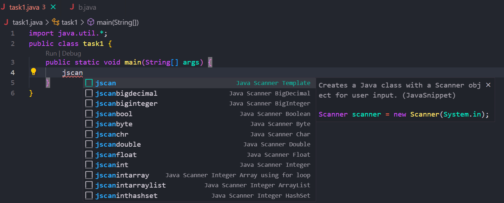

# Java Easy Snippet

## Description

Boost your Java development productivity with the **Java Boilerplate Generator** extension for Visual Studio Code. Say goodbye to repetitive code setup and hello to streamlined project initialization. This extension provides essential Java boilerplate code snippets and templates, helping you kickstart your projects swiftly and efficiently.

## How to Use

**Step 1:** Install Java Easy Snippet  
**Step 2:** Not Downloaded Yet? [Download Now](https://marketplace.visualstudio.com/items?itemName=BamaCharanChhandogi.JavaSnippet)  
**Step 3:** Find all snippets below and use as per need.  
**Step 4:** Happy Coding

## Demo Screenshot



# All  Java Snippet Shortcuts here

| No  | Java Snippet Short Code | Description                         |
| :-- | :----------------------- | :----------------------------------|
| 1   | java                    | Basic Java Class with Main Method   |
| 2   | jclass                    | Basic Java public Class code      |
| 3   | jmain                    | Basic Java code with Main Method   |
| --- |--------------------------|----------------------------------- |
| --- |--------------------------|----------------------------------- |
| 4   | jscan                   |Java class with a Scanner object for user input  |
| 5   | jscanint                   | Scanner object for user input Integer  |
| 6   | jscanstr                   | Scanner object for user input String        |
| 7   | jscandouble                   | Scanner object for user input double   |
| 8   | jscanlong                   | Scanner object for user input Long|
| 9   | jscanfloat                   | Scanner object for user input Float|
| 10   | jscanbool                   | Scanner object for user input Boolean|
| 11   | jscanbyte                   | Scanner object for user input Byte|
| 12   | jscanshort                   |Scanner object for user input short|
| 13   | jscanchr                   |Scanner object for user input Char |
| 14   | jscanbiginteger                   |Scanner object for user input Big Integer |
| 15  | jscanbigdecimal                   |Scanner object for user input Big Decimal |
| 16  | jscannextline                   |Scanner object for user input Next Line|
| 17  | jscanintarray                   | Scanner object for user input Integer Array|
| 18   | jscanstrarray                   | Scanner object for user input String Array   |
| 19   | jscanintarraylist                   | Scanner object for user input Integer ArrayList |
| 20   | jscanstrarraylist                   |Scanner object for user input String ArrayList |
| 21   | jscanintlinkedlist                   | Scanner object for user input Integer LinedList|
| 22   | jscanstrlinkedlist                   | Scanner object for user input String LinkedList|
| 23   | jscanintqueue                   | Scanner object for user input Integer Queue|
| 24   | jscanstrqueue                   | Scanner object for user String Queue |
| 25   | jscanintstack                   | Scanner object for user input Integer stack |
| 26   | jscanstrstack                   | Scanner object for user String Integer Stack |
| 27   | jscanintset              | Scanner object for user input Integer set|
| 28   | jscanstrset              | Scanner object for user input String Set|
| 29   | jscaninttreemap              |Scanner object for user input Integer TreeMap |
| 30  | jscanstrtreemap              |Scanner object for user input String treeMap |
| 31   | jscanintpriorityqueue              |Scanner object for user input Integer Priority Queue|
| 32  | jscanstrpriorityqueue              |Scanner object for user String Integer Priority Queue|
| 33   | jscaninthashset         |Scanner object for user input Integer Hash Set|
| 34   | jscanstrhashset         |Scanner object for user input String Hash set|
| 35   | jscaninttreeset         |Scanner object for user input Integer Tree Set|
| 36   | jscanstrtreeset         |Scanner object for user input String Tree Set|
| 37   | jscanintlinkedhashset   |Scanner object for user input Integer Linked Hash Set |
| 38   | jscanstrlinkedhashset   |Scanner object for user input String Linked Hash set|
| --- |--------------------------|----------------------------------- |
| --- |--------------------------|----------------------------------- |
| 39   | jout                    | Creates a Java output  code        |
| 40   | joutarray               | Creates a Java output code of Array|
| 41   | joutarraylist           | Creates a Java output code of ArrayList|
| 42   | jouthashmap             | Creates a Java output  code HashMap    |
| 43   | joutlinkedlist          | Creates a Java output  code LinkedList |
| 44   | joutqueue               | Creates a Java output  code Queue   |
| 45   | joutstack               | Creates a Java output  code Stack   |
| 46   | joutset                 | Creates a Java output  code    Set  |
| 47   | jouttreemap             | Creates a Java output  code Tree Map|
| 48   | joutpq                  | Creates a Java output  code Priority Queue|
| 49   | jouthashset             | Creates a Java output code of Hash-Set    |
| 50   | jouttreeset             | Creates a Java output code of Tree-Set|
| 51   | joutlinkedhashset       | Creates a Java output code of Linked Hash Set|
| --- |--------------------------|----------------------------------- |
| --- |--------------------------|----------------------------------- |
| 52   | jarraylist              | Java Class with ArrayList           |
| 53   | jarraylist              | Java Class with ArrayList           |
| 54   | jarraylist              | Java Class with ArrayList           |
| 55   | jhashmap                | Java Class with HashMap             |
| 56   | jlinkedlist             | Java Class with LinkedList          |
| 57   | jqueue                  | Java Class with Queue               |
| 58   | jstack                  | Java Class with Stack               |
| 59   | jset                    | Java Class with HashSet             |
| 60  | jtreemap                | Java Class with TreeMap             |
| 61  | jpqueue                 | Java Class with PriorityQueue       |
| 62  | jhashset                | Java Class with HashSet             |
| 63  | jtreeset                | Java Class with TreeSet             |
| 64  | jlinkedhashset          | Java Class with LinkedHashSet       |
| 65  | jarraylistiter          | Java Class with ArrayList Iteration |
| 66  | jhashmapiter            | Java Class with HashMap Iteration   |
| 67  | jlinkedlistiter         | Java Class with LinkedList Iteration|
| 68  | jqueueiter              | Java Class with Queue Iteration     |
| 69  | jstackiter              | Java Class with Stack Iteration     |
| 70  | jsetiter                | Java Class with Set Iteration       |
| 71  | jtreemapiter            | Java Class with TreeMap Iteration   |
| 72  | jpqueueiter             | Java Class with PriorityQueue Iteration  |
| --- |-------------------------|----------------------------------- |
| --- |-------------------------|----------------------------------- |
| 73  | userarray               |user-defined Array                    |
| 74  | userarraylist            | user-defined ArrayList    |
| 75  | userlinkedlist            | user-defined Singly LinkedList   |
| 76  | userdoublylinkedlist            | user-defined Doubly  LinkedList   |
| 77  | usercircularlinkedlist            | user-defined Circular LinkedList |
| 78  | userstack            |user-defined Stack  |
| 79  | userqueue            |user-defined Queue   |
| 80  | userpriorityqueue            |user-defined Priority Queue   |
| 81  | userhashset            |user-defined Hash Set  |
| 82  | usertreeset            | user-defined Tree Set   |
| 83 | userlinkedhashset            | User-defined Linked Hash Set  |
| 84  | userhashmap            | User-defined Hash Map   |
| 85  | usertreemap            | User-defined Tree Map   |

<br>
<!-- ## View Demo Codes  -->

<!--  -->

# View Sample Snippet Codes of All Formats.

### ❇️ java = Basic Java Class with Main Method

```java
public class Main {
    public static void main(String[] args) {
        $0
    }
}
```
### ❇️ jclass = Basic Java Public Class
```java
public class Main {
}
```
### ❇️ jmain = Basic Java Main Method
```java
    public static void main(String[] args) {
        $0
    }
```
```<!------------------------------------------------------------------------------------------> ```

### ❇️ jscan = Java Class with Scanner
```java
Scanner scanner = new Scanner(System.in);
```
<!-- Input section -->
### ❇️ jscanint = Creates a Java class with a Scanner object for user input Integer
```java
int ${1:variable} = scanner.nextInt();
```

### ❇️ jscanstr = Creates a Java class with a Scanner object for user input String
```java 
String ${1:variable} = scanner.nextLine();
```

### ❇️ jscandouble = Creates a Java class with a Scanner object for user input Double
```java
double ${1:variable} = scanner.nextDouble();
```
## ❇️ jscandfloat = Creates a Java class with a Scanner object for user input Float
```java
float ${1:variable} = scanner.nextFloat();
```
## ❇️ jscanlong = Creates a Java class with a Scanner object for user input Long
```java
float ${1:variable} = scanner.nextLong();
```
## ❇️ jscanbool = Creates a Java class with a Scanner object for user input Boolean
```java
boolean ${1:variable} = scanner.nextBoolean();
```

## ❇️ jscannextline = Creates a Java class with a Scanner object for user input Line
```java
scanner.nextLine();
```
## ❇️ jscanintarray = Creates a Java class with a Scanner object for user input Integer Array.
```java
Scanner scanner = new Scanner(System.in);
int[] arr = new int[scanner.nextInt()];

for (int i = 0; i < arr.length; i++) {
    arr[i] = scanner.nextInt();
}
```
### ❇️ jscanstrarray = Creates a Java class with a Scanner object for user input String Array
```java
Scanner scanner = new Scanner(System.in);
int n = scanner.nextInt();
scanner.nextLine(); // Consume the newline character

String[] arr = new String[n];
for (int i = 0; i <arr.length; i++) {
    arr[i] = scanner.nextLine();
}
```
### ❇️ jscanintarraylist = Creates a Java class with a Scan scanner object for user input Integer Array list
```java
Scanner scanner = new Scanner(System.in);
int n = scanner.nextInt();

ArrayList<Integer> list = new ArrayList<>();
for (int i = 0; i < n; i++) {
    list.add(scanner.nextInt());
}
```
### ❇️ jscanstrarraylist = Creates a Java class with a Scan scanner object for user input String Array list
```java
Scanner scanner = new Scanner(System.in);
int n = scanner.nextInt();
scanner.nextLine(); // Consume the newline character

ArrayList<String> list = new ArrayList<>();
for (int i = 0; i < n; i++) {
    list.add(scanner.nextLine());
}
```
### ❇️ jscanintlinkedlist = Creates a Java class with a Scan scanner object for user input Integer LinkedList
```java
Scanner scanner = new Scanner(System.in);
int n = scanner.nextInt();

LinkedList<Integer> list = new LinkedList<>();
for (int i = 0; i < n; i++) {
    list.add(scanner.nextInt());
}
```
### ❇️ jscanstrlinkedlist = Creates a Java class with a Scan scanner object for user input String LinkedList
```java
Scanner scanner = new Scanner(System.in);
int n = scanner.nextInt();
scanner.nextLine(); // Consume the newline character

LinkedList<String> list = new LinkedList<>();
for (int i = 0; i < n; i++) {
    list.add(scanner.nextLine());
}
```
### ❇️ jscanintqueue = Creates a Java class with a Scan scanner object for user input Integer Queue
```java
Scanner scanner = new Scanner(System.in);
int n = scanner.nextInt();

Queue<Integer> queue = new LinkedList<>();
for (int i = 0; i < n; i++) {
    queue.offer(scanner.nextInt());
}
```
### ❇️ jscanstrqueue = Creates a Java class with a Scan scanner object for user input String Queue
```java
Scanner scanner = new Scanner(System.in);
int n = scanner.nextInt();
scanner.nextLine(); // Consume the newline character

Queue<String> queue = new LinkedList<>();
for (int i = 0; i < n; i++) {
    queue.offer(scanner.nextLine());
}
```
### ❇️ jscanintstack = Creates a Java class with a Scan scanner object for user input Integer Stack
```java
Scanner scanner = new Scanner(System.in);
int n = scanner.nextInt();

Stack<Integer> stack = new Stack<>();
for (int i = 0; i < n; i++) {
    stack.push(scanner.nextInt());
}
```
### ❇️ jscanstrstack = Creates a Java class with a Scan scanner object for user input String Stack
```java
Scanner scanner = new Scanner(System.in);
int n = scanner.nextInt();
scanner.nextLine(); // Consume the newline character

Stack<String> stack = new Stack<>();
for (int i = 0; i < n; i++) {
    stack.push(scanner.nextLine());
}
```
### ❇️ jscanintset = Creates a Java class with a Scan scanner object for user input Integer Set
```java
Scanner scanner = new Scanner(System.in);
int n = scanner.nextInt();

Set<Integer> set = new HashSet<>();,
for (int i = 0; i < n; i++) {
    set.add(scanner.nextInt());
}
```
### ❇️ jscanstrset = Creates a Java class with a Scan scanner object for user input String Set
```java
Scanner scanner = new Scanner(System.in);
int n = scanner.nextInt();
scanner.nextLine(); // Consume the newline character

Set<String> set = new HashSet<>();,
for (int i = 0; i < n; i++) {
    set.add(scanner.nextLine());
}
```

### ❇️ jscaninttreemap = Creates a Java class with a Scan scanner object for user input Integer TreeMap
```java
Scanner scanner = new Scanner(System.in);
int n = scanner.nextInt();

Map<Integer, Integer> map = new TreeMap<>();
for (int i = 0; i < n; i++) {
    set.add(scanner.nextInt());
}
```
### ❇️ jscansrset = Creates a Java class with a Scan scanner object for user input String TreeMap
```java
Scanner scanner = new Scanner(System.in);
int n = scanner.nextInt();
scanner.nextLine(); // Consume the newline character

Map<String, Integer> map = new TreeMap<>();
for (int i = 0; i < n; i++) {
    map.put(scanner.nextLine(), scanner.nextInt());
}
```
```<!-------------------------------------------------------------------------------------> ```

### ❇️ jout = Creates a Java output code
```java
System.out.println();
```
### ❇️ joutarray = Creates a Java output code of Array
```java
for (int i = 0; i < arr.length; i++) {
    System.out.println(arr[i]);
}
```
### ❇️ joutarraylist = Creates a Java output code of ArrayList
```java
for (int i = 0; i < list.size(); i++) {
    System.out.println(list.get(i));
}
```
### ❇️ jouthashmap = Creates a Java output code of Hash Map
```java
for (Map.Entry<String, Integer> entry : map.entrySet()) {
    System.out.println(entry.getKey() + entry.getValue());
}
```
### ❇️ joutlinkedlist = Creates a Java output code of LinkedList
```java
for (int i = 0; i < list.size(); i++) {
    System.out.println(list.get(i));
}
```
```<!---------------------------------------------------------------------------------> ```

### ❇️ jarraylist = Java Class with ArrayList
```java
ArrayList<Integer> list = new ArrayList<>();
```
### ❇️ jhashmap = Java Class with HashMap
```java
HashMap<String, Integer> map = new HashMap<>();
```
### ❇️ jlinkedlist = Java Class with LinkedList
```java
LinkedList<Integer> list = new LinkedList<>();
```
### ❇️ jqueue = Java Class with Queue
```java
Queue<Integer> queue = new LinkedList<>();
```
### ❇️ jstack = Java Class with Stack
```java
Stack<Integer> stack = new Stack<>();
```
### ❇️ jset = Java Class with HashSet
```java
HashSet<Integer> set = new HashSet<>();
```
```<!--------------------------------------------------------------------------------------> ```
### ❇️ userlinkedlist = User Defined Linked List code.
```java
static class LinkedList<T> {
    private Node<T> head;
    private int size;

    private static class Node<T> {
        T data;
        Node<T> next;

        Node(T data) {
            this.data = data;
            this.next = null;
        }
    }

    public LinkedList() {
        head = null;
        size = 0;
    }

    public void add(T element) {
        Node<T> newNode = new Node<>(element);
        if (head == null) {
            head = newNode;
        } else {
            Node<T> current = head;
            while (current.next != null) {
                current = current.next;
            }
            current.next = newNode;
        }
        size++;
    }

    public void print() {
        Node<T> current = head;
        while (current != null) {
            System.out.print(current.data + " ");
            current = current.next;
        }
        System.out.println();
    }

    public int size() {
        return size;
    }
}
```
### ❇️ userhashset = User defined hash Set 
```java
static class HashSet<T> {
    private HashMap<T, Boolean> map;

    public HashSet() {
        map = new HashMap<>();
    }

    public void add(T element) {
        map.put(element, true);
    }

    public boolean contains(T element) {
        return map.containsKey(element);
    }

    public void remove(T element) {
        map.remove(element);
    }

    public boolean isEmpty() {
        return map.isEmpty();
    }

    public int size() {
        return map.size();
    }
}
```
### ❇️ userstack = User Defined Stack 
```java
static class Stack<T> {
    private Node<T> top;
    private int size;

    private static class Node<T> {
        T data;
        Node<T> next;

        Node(T data) {
            this.data = data;
            this.next = null;
        }
    }

    public Stack() {
        top = null;
        size = 0;
    }

    public void push(T element) {
        Node<T> newNode = new Node<>(element);
        newNode.next = top;
        top = newNode;
        size++;
    }

    public T pop() {
        if (top == null) {
            throw new EmptyStackException();
        }
        T data = top.data;
        top = top.next;
        size--;
        return data;
    }

    public T peek() {
        if (top == null) {
            throw new EmptyStackException();
        }
        return top.data;
    }

    public boolean isEmpty() {
        return top == null;
    }

    public int size() {
        return size;
    }
}
```